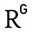

# Oliver Czibula

Hi there! 👋🏻

I am a specialist in mathematical optimisation, machine learning, and software engineering with over 15 years of professional experience.
I completed my PhD in 2016, investigating efficient approaches to solving scheduling, timetabling, rostering, and assignment problems arising in industry: [Optimisation Algorithms for Planning and Scheduling Workplace Training](https://opus.lib.uts.edu.au/handle/10453/130297).
I was part of the [Optimisation Group](https://www.uts.edu.au/about/faculty-science/what-we-do/our-research-areas/mathematical-sciences/optimisation-group) while at the University of Technology Sydney (UTS).

My professional experience in the energy industry includes electricity and gas price forecasting; mains frequency monitoring, visualisation, and anomaly detection; and optimal control of residential rooftop solar+battery and grid-scale solar+battery+gas setups.

I have experience working in and leading a Data Science team at a multinational software/technology company servicing the global logistics industry.
The areas of application primarily involve data analysis and interactive reporting; anomaly detection; recommender systems; revenue forecasting; natural language processing methods for content classification and suggestion; predictive analytics; and vehicle routing.
The team works in a fully end-to-end manner: from ideation, to requirements gathering, to research and prototyping, to engineering data pipelines/models/APIs for incremental delivery, to handover.

I have had the pleasure to do some volunteer work over the years.
In 2017 I was a Business/Communications panelist at UTS ["Your Future in Science and Maths"](https://fliphtml5.com/fhml/cmpz/basic) event, designed to provide students with ideas about where their Science and Maths degrees can take them.
In 2020 I developed and presented workshops on Machine Learning at the [National Computer Science School](https://grokacademy.org/ncss/).
I served as an industry mentor to PhD students in 2022 and again in 2023 as part of the UTS [Women in STEM Research (WiSR) Mentoring Program](https://www.uts.edu.au/about/faculty-engineering-and-information-technology/women-engineering-and-it/initiatives-uts-students/women-stem-research-wisr-mentoring-program). 

When I'm not working, I enjoy spending time with my family, rock climbing, cycling, bush walking, weight lifting, cooking, 3D printing, and playing board games.

